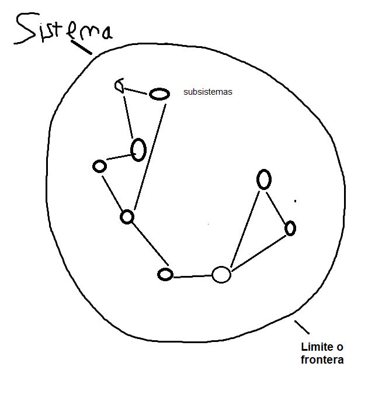

## Metodologia de desarrollo de sistemas

* Estructuras
    * Formado por etapas
	    * Recevamiento
		* Diagnostico
            * Informe
            * Analisis F.O.D.A.
                * Analisis de Factibilidad
                    * Tecnica
                    * Economica
                    * Operativamente factible
    * Planeamiento (Informe)
    * Negocio y vendo el proyecto
    * Implementacion
    * Control y Seguimiento
#### Recevamiento
Vamos a tener que encontrar una empresa que necesite un proyecto relacionado con bases de detos. Temdremos que hacer un informe, en el planeamiento, analizando que cosas se podrian hacer para mejorar un sistema ya existente.

#### Diagnostico
El analisis FODA requiere que el proyecto sea tecnicamente posible para nosotros, que sea economicamente  viable para la empresa (los costos), y que sea factible depende de que los usuarios para los que creas el producto lo puedan usar, y esto se facilita mucho usando un sistema de desarrollo acompaniado, donde se va actualizando y consultando al creador durante todo el tiempo de desarrollo, asi se sienten parte del proyecto.

El informe debe detallar como sera el funcionamiento del sistema. Dira en que lenguaje se desarrolla y por que, por ejemplo. Este debe ser aprobado por el cliente

#### Implementacion
como se aplica el proyecto dentro del sistema. programar el sistema. Este puede funcionar lado a lado con el anterior, o de cualquier otro modo

#### Control y seguimiento
despues de la implementacion se debe seguir el sistema por una cierta cantidad de tiempo haciendo un seguimiento por cualquier cantidad de tiempo en el que pueda llegar a ser necesario, ya que aunque hagas pruebas nunca vas a poder saber si funciona de verdad hasta que es usado con los datos reales.

---

Metodologias Agiles:
se van haciendo entregas parciales para que el cliente vaya haciendo correcciones antes de que este completo el proyecto. Hoy en dia se hace casi exclusivamente asi.

###### organizaciones != empresas  

las dos tienen propositos y recursos diferentes.

###### Sistemas abiertos y cerrados

Los sistemas abiertos son aquellos sistemas que tienen una gran comnicacion con el exterior. Al tener ese intercambio permanente con lo que pasa afuera son obligados a modernizarse permanentemente.   

Los sistemas cerrados tienen poca comunicacion con el exterior y al largo plazo termina quedando desactualizado.

Existe consenso respecto al retraso argentino en desarrollar su industria textil hasta la decada del 30. Todav'ia en 1923, una encuesta oficial determino que el consumo de textiles estaba abastecido en un 73% por las importaciones. Los textiles, junto con los productos de acero, constituian entre la mitad y un tercio de las importaciones.

Clasificar los siguientes sistemass

* Perro: Abierto
* Club Deportivo: Abiero
* Empresa: Abierto
* Juguete a cuerda: Cerrado
* Pino: Abierto
* Silla: Cerrado
* Individuo: Abierto
* Sistema Solar: Abierto
* Ni~nio: Abierto
* Termostato: Abierto
* Plancha: Abierto
* Equipo de futbol : abierto
* Partido de futbol: abierto
* Personas caminando por florida entre plaza san martin y av cordoba: no es sistema
* Banco en una plaza: no es un sistema
* Reloj: abierto
* Tres desconocidos en una habitacion: cerrado

  
  
sistema
: conjunto organizado de cosas o partes interactuantes de interdependientes que se relacionan con un todo orgnaizado unitario y complejo. Esas cosas o partes se pueden enumerar en entradas, proesos y salidas.

entradas
: son los ingresos del sistema que pueden ser recursos materiales, humanos o informacion

proceso
: es lo que transforma una entrada en salida. por lo tanto puede ser una maquina, un individuo, una computadora, un producto quimico, etc.

caja negra
: se utiliza para representar a los sistemas cuando no sabemos que elementos o cosas componen al sistema o proceso, pero sabemos que a determinadas entradas corresponden determinadas salidas.

salidas
: las salidas de los sistemas son los resultados que se obtienen de procesar las entradas. Al igual que las entradas estas pueden adoptar la forma de productos, servicios e informacion. 

Las salidas de un sistema se convierten en untrada de otro, que la procesa para convertirla en otra salida repitiendo este ciclo indefinidamente.

contexto o ambiente
: un sistema siempre estara relacionado con el contexto que lo rodea, o sea, el conjunto de objetos exteriores al sistema pero que influyen decididamente a este y a su vez el sistema influye, aunque en una menor proporcion sobre el contexto.   

Determinar el limite de interes es fundamental para marcar el foco de analisis, puesto que solo sera considerado lo que quede dentro de ese limite.
  
subsistemas
: Se hace referencia a los subsistemas que lo componen, cuando se indica que el mismo esta formado por partes o cosas que forman el todo. Estos conjuntos o partes pueden ser a su vez sistemas ya que onforman un todo en si mismo y serian de un rango inferior al sistema que lo compone.
  
retroalimentacion
: se produce cuando las salidas del sistema con la influencia de las salidas del sistema en el contexto vuelvena ingresar al sistema en forma de recursos o informacion. La retroalimentacion permite el control de un sistema y que el mismi tome medidas de correccion en base a la informacion retroalimentada.

homeostasis
: es la propiedad de un sistema que define su nivel de respuesta y de adaptacion al contexto. Es el nivel de adaptacion permanente del sistema por su tendencia a la supervivencia dinamica.

entropia
: es el desgaste del sistema presenta por el transcurso de tiempo o por el funcionamiento del mismo
  
permeabilidad
: mide la interaccion que este reibe del medio, te dice que a mayor o menor permeabilidad del sistema sera mas o menos abierto. Los sistemas que tienen mucha relacion con el medio en el cual se desarrollan, son sistemas altamente permeables. 
  
A partir de esto se pueden clasificar los sistemas en  
abiertos
: son sistemas que tienen altos grados de permeabilidad, es decir, estan relacionados con su ambiente.  
Cerrados
: no intercambian nada con el ambiente y por lo tanto no son permeables.

